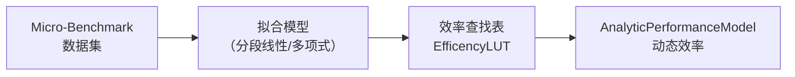
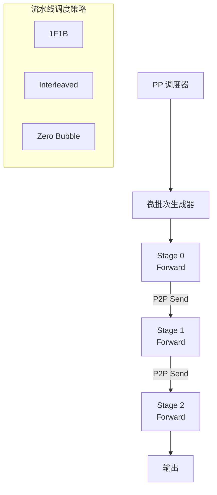
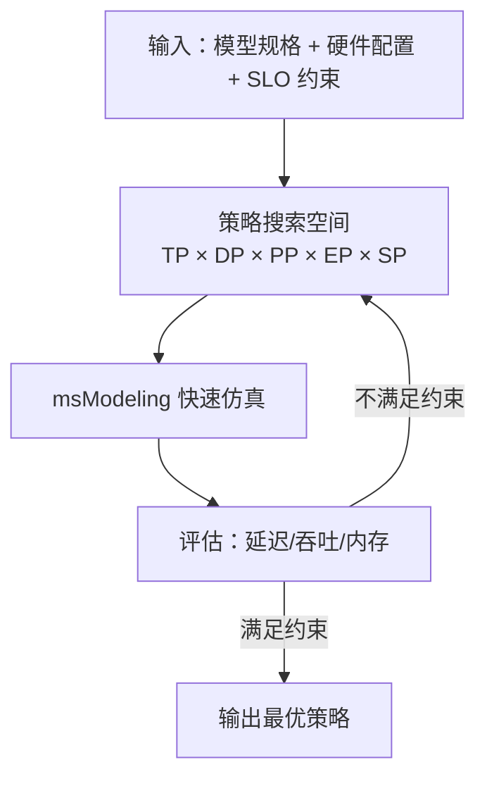

# 局限性与升级计划 — msModeling

## 目录

- [1. 当前局限性](#1-当前局限性)
- [2. 挑战](#2-挑战)
- [3. 升级计划 (Roadmap)](#3-升级计划-roadmap)
- [4. 实施步骤](#4-实施步骤)

---

## 1. 当前局限性

### 1.1 并行策略覆盖

| 并行策略 | 当前支持状态 | 说明 |
|----------|-------------|------|
| 张量并行（TP） | ✅ 已支持 | 通过 `ParallelGroupManager` 实现 |
| 数据并行（DP） | ✅ 已支持 | 基础 DP 分组 |
| 流水线并行（PP） | ⚠️ 部分支持 | 配置中已定义 `pipeline_parallel_size`，但调度逻辑尚未完善 |
| 专家并行（EP） | ✅ 已支持 | 通过 `all_to_all` 原语实现 MoE 专家分发 |
| 序列并行（SP） | ❌ 未支持 | 未实现长序列切分与通信 |
| 上下文并行（CP） | ❌ 未支持 | Ring Attention / Ulysses 等长上下文并行策略未实现 |

**代码证据：**
- `tensor_cast/parallel_group.py` 第 97-150 行的 `ParallelGroupManager.initialize_model_parallel()` 仅初始化了 TP 和 DP 通信组
- PP 阶段间的通信（Send/Recv）和流水线调度（如 1F1B、Interleaved）缺乏建模
- 虽然 `docs/RFC/` 中有 `rfc_add_ulysses_for_diffusers` 文档，但 CP/SP 仅在 Diffusers 模型中有初步探索

### 1.2 硬件建模精度

| 方面 | 局限性 |
|------|--------|
| **HBM 带宽模型** | 当前采用单一带宽数值（`memory_bandwidth_bytes_ps`），未区分 HBM 的读/写不对称特性，也未建模 HBM3/HBM3E 的通道级带宽瓶颈 |
| **缓存层级** | `device.py` 第 96 行标注 `# TODO: add cache properties`，当前完全忽略 L1/L2 Cache 的加速效果 |
| **效率参数** | 计算效率 0.7、内存效率 0.6、通信效率 0.7 均为硬编码常量（`device.py` 第 208-210 行注释 "The efficiencies are something we need to calibrate"），未根据算子规模动态调整 |
| **静态开销** | `StaticCost` 中的 MMA/GP/Comm 固定开销（5µs/2µs/10µs）是粗粒度估计 |
| **多流并行** | `runtime.py` 第 61 行标注 `# TODO: add multi-stream support`，当前假设单流串行执行 |

### 1.3 计算建模

| 方面 | 局限性 |
|------|--------|
| **指令级并行（ILP）** | `analytic.py` 第 137 行注释 "we do not consider instruction-level parallelism"，MMA 与 GP 运算时间直接相加 |
| **算子融合** | 编译 Pass 仅支持有限的融合模式（RMSNorm、RotaryEmbedding、MergeLinear），缺少 FlashAttention、SwiGLU 等重要融合 |
| **动态形状** | 对变长序列（Variable-Length）的 Padding 开销未精确建模 |
| **FP4 支持** | 虽然 `DTYPE_FP4` 和 `MXFP4` 已注册，但 A2 系列设备未配置 FP4 算力（`device.py` 中 A2 设备缺少 `DTYPE_FP4` 条目） |

### 1.4 服务化仿真

| 方面 | 局限性 |
|------|--------|
| **调度策略** | `BatchScheduler._schedule()` 使用简单的 FIFO + 尾部抢占策略，缺少优先级调度、SJF 等高级策略 |
| **负载均衡** | `EngineLoadBalancer.select()` 使用贪心最小负载策略，未考虑请求特征（长短不一的 Prefill/Decode） |
| **网络延迟** | 客户端到服务端的网络延迟未建模 |
| **预处理** | Tokenization、Detokenization 的 CPU 开销未建模 |
| **Continuous Batching** | 当前为 Step-Level Batching，未实现 Iteration-Level Continuous Batching |

### 1.5 模型覆盖

| 方面 | 局限性 |
|------|--------|
| **Diffusion 模型** | RFC 中有 Diffusers 支持计划但实现尚不完整 |
| **多模态输入** | 仅支持图像输入（Qwen3-VL），视频/音频输入未覆盖 |
| **Encoder-Decoder** | 仅支持 Decoder-Only 架构，Encoder-Decoder（如 T5）未覆盖 |

---

## 2. 挑战

### 2.1 效率参数校准

**问题描述：**
当前所有设备的计算效率、内存效率、通信效率均为固定常量（70%/60%/70%），但实际效率高度依赖于：
- 算子的计算密度（Arithmetic Intensity）
- 张量形状（batch size、sequence length）
- 数据类型与量化方案
- 通信消息大小

**技术难点：**
- 需要在真实硬件上进行大规模 micro-benchmark
- 效率-规模关系可能是非线性的
- 不同算子的效率差异显著

### 2.2 通信-计算重叠

**问题描述：**
当前仿真假设所有算子串行执行（单流模型）。在实际部署中，通信操作（如 AllReduce）通常与下一层的计算重叠执行。

**技术难点：**
- 需要引入多流/多事件调度模型
- 重叠度依赖于具体框架实现（如 Megatron-LM 的 Overlap Communication）
- 需要精确建模通信与计算的依赖关系

### 2.3 PP 流水线调度建模

**问题描述：**
PP 并行需要建模微批次（Micro-Batch）在多个 Stage 之间的流水线调度，包括 1F1B（One Forward One Backward）、Interleaved Pipeline 等策略。

**技术难点：**
- 推理场景下 PP 的 Stage 间通信模式（Point-to-Point Send/Recv）与集合通信不同
- 气泡率（Bubble Rate）的计算需要全局视角
- 需要与 TP 策略联合优化

### 2.4 大规模验证

**问题描述：**
仿真结果的准确性需要与真实硬件上的端到端性能数据进行对比验证。

**技术难点：**
- 不同模型、不同规模、不同并行策略的组合空间庞大
- 真实硬件上的性能波动（温度、调频等）增加了对比难度
- 需要建立系统化的验证框架

### 2.5 异构计算

**问题描述：**
未来昇腾平台可能引入异构计算单元（如 AI Core + Vector Core + CPU Offload），当前模型仅区分 MMA 和 GP 两类计算单元。

**技术难点：**
- 异构计算单元之间的数据搬运和同步开销建模
- 任务划分策略对性能的影响
- 多种计算单元的效率参数各异

---

## 3. 升级计划 (Roadmap)

### 3.1 短期优化（0-3 个月）

#### A. 效率参数动态化

**目标：** 将硬编码的效率参数替换为基于算子规模的查找表或拟合函数。

**方案：**



在 `tensor_cast/performance_model/analytic.py` 的 `_estimate_default_without_static_cost()` 中，将：

```python
device_mma_ops = device_profile.mma_ops[dtype] * device_profile.compute_efficiency
```

替换为：

```python
efficiency = device_profile.get_compute_efficiency(dtype, op_size=mma_ops)
device_mma_ops = device_profile.mma_ops[dtype] * efficiency
```

#### B. Cache 层级建模

**目标：** 在 `DeviceProfile` 中添加 L1/L2 Cache 属性，对小张量访存提供更精确的估算。

**方案：** 扩展 `DeviceProfile` 数据类：

```python
@dataclass
class CacheProfile:
    l1_size_bytes: float
    l1_bandwidth_bytes_ps: float
    l2_size_bytes: float
    l2_bandwidth_bytes_ps: float
```

在访存时间计算中，根据数据量选择相应的带宽。

#### C. 多流支持

**目标：** 在 `Runtime` 中引入多流调度，支持通信-计算重叠建模。

**方案：** 在 `RuntimeEvent` 中添加 stream 属性，在 `replay_op_invoke_infos()` 中按 stream 并行累加时间。

#### D. FP4 设备支持完善

**目标：** 为 ATLAS_800_A2 系列设备补充 FP4 算力配置。

**方案：** 在 `device.py` 的 A2 设备定义中添加 `DTYPE_FP4` 条目。

#### E. 代码重构

**目标：** 提升代码可维护性。

- 将 `tensor_cast/performance_model/__init__.py` 中超过 1100 行的算子属性注册拆分为独立模块
- 统一 `tensor_cast/core/model_runner.py` 和 `serving_cast/model_runner.py` 的接口

### 3.2 中期演进（3-6 个月）

#### A. PP 流水线并行完整支持

**目标：** 实现 PP 并行的完整建模，包括 Stage 划分、微批次调度和 P2P 通信。

**方案：**



需要新增：
1. `P2PSend` / `P2PRecv` 通信原语及性能模型
2. PP 调度器：支持 1F1B、Interleaved 等策略
3. 气泡率计算逻辑

#### B. 序列并行（SP）与上下文并行（CP）

**目标：** 支持长序列场景下的 SP/CP 策略。

**方案：**
1. **SP（Megatron-Style）**：在 Attention 和 FFN 之间插入 AllGather/ReduceScatter
2. **CP（Ring Attention）**：将序列沿 sequence 维度切分，环形传递 KV Cache
3. **CP（Ulysses）**：基于 AllToAll 的序列并行

#### C. 高级调度策略

**目标：** 在 ServingCast 中支持更多调度算法。

| 策略 | 适用场景 |
|------|----------|
| Priority-Based | 差异化 SLO 要求 |
| Shortest-Job-First | 已知输入长度时优化 TTFT |
| Iteration-Level Continuous Batching | 降低 Decode 阶段的排队延迟 |
| Speculative Decoding Scheduling | 与 MTP 联合优化 |

#### D. 经验性能模型

**目标：** 实现基于真实硬件 benchmark 数据的经验性能模型，与解析模型互补。

**方案：** 利用 `tensor_cast/performance_model/empirical.py`（目前为预留）和 `tensor_cast/performance_model/op_benchmark.py` 完成：
1. 在真实硬件上运行 micro-benchmark
2. 构建 算子签名 → 延迟 的查找表
3. 对未覆盖的算子回退到解析模型

### 3.3 长期演进（6-12 个月）

#### A. 新型昇腾架构适配

**目标：** 适配未来的昇腾硬件架构。

| 维度 | 需要适配的方面 |
|------|---------------|
| **新计算单元** | 新增数据类型（如 FP6、INT4）的算力配置 |
| **新互联拓扑** | 支持多层级 Mesh、Torus 等拓扑类型 |
| **新内存技术** | HBM3E/HBM4 的通道级带宽建模 |
| **异构计算** | AI Core + Vector Core 联合调度 |

#### B. 训练场景支持

**目标：** 从推理扩展到训练场景的性能仿真。

需要新增：
1. 反向传播（Backward Pass）的算子属性注册
2. 梯度通信（AllReduce/ReduceScatter）的建模
3. 优化器步骤的内存与计算建模
4. ZeRO-1/2/3 策略的内存优化建模

#### C. 自动并行策略搜索

**目标：** 在给定硬件配置和模型规格的条件下，自动搜索最优并行策略组合。



#### D. 可视化与交互式分析平台

**目标：** 提供 Web 界面的仿真结果分析平台。

功能包括：
- 算子级时间线可视化（扩展 Chrome Trace）
- 内存占用水位图
- 通信拓扑图与热力图
- 多方案对比分析
- 参数灵敏度分析

---

## 4. 实施步骤

### Phase 1：基础优化（短期）

```
Step 1: 效率参数动态化
├── 1.1 定义 EfficiencyProfile 数据类（扩展 DeviceProfile）
├── 1.2 收集 micro-benchmark 数据（需要真实硬件访问）
├── 1.3 实现分段线性/多项式拟合
├── 1.4 修改 _estimate_default_without_static_cost() 使用动态效率
└── 1.5 编写单元测试，验证精度提升

Step 2: 多流支持
├── 2.1 在 RuntimeEvent 中添加 stream_id 字段
├── 2.2 在 Runtime 中实现多 stream 时间线
├── 2.3 为通信算子标记独立 stream
├── 2.4 修改 total_execution_time_s() 支持 stream 并行
└── 2.5 更新 Chrome Trace 导出，按 stream 分 thread

Step 3: 算子属性模块拆分
├── 3.1 将 __init__.py 中的属性注册按类别拆分为独立文件：
│     ├── op_properties_matmul.py
│     ├── op_properties_attention.py
│     ├── op_properties_communication.py
│     ├── op_properties_linear.py
│     └── op_properties_elementwise.py
├── 3.2 更新 __init__.py 的导入逻辑
└── 3.3 确保所有单元测试通过
```

### Phase 2：并行策略扩展（中期）

```
Step 4: PP 流水线并行
├── 4.1 实现 P2PSend/P2PRecv 通信原语
│     ├── 在 tensor_cast/ops/ 中注册新算子
│     ├── 在 performance_model/ 中添加 P2P 性能估算
│     └── 在 parallel_group.py 中添加 P2P 方法
├── 4.2 实现 PP 调度器
│     ├── 定义 PipelineSchedule 抽象类
│     ├── 实现 1F1B 策略
│     └── 实现 Interleaved 策略
├── 4.3 修改 model_builder.py 支持 Stage 划分
├── 4.4 修改 input_generator.py 支持微批次
└── 4.5 编写集成测试

Step 5: SP/CP 支持
├── 5.1 实现 Megatron-SP（TP + AllGather/ReduceScatter 模式）
├── 5.2 实现 Ring Attention CP（序列维度切分 + 环形 KV 传递）
├── 5.3 实现 Ulysses CP（AllToAll 模式）
├── 5.4 修改 ConfigResolver 支持 SP/CP 配置
└── 5.5 编写端到端测试
```

### Phase 3：高级功能（中期）

```
Step 6: 经验性能模型
├── 6.1 设计 micro-benchmark 测试套件
│     ├── GEMM benchmark（变化 M/N/K/dtype）
│     ├── Attention benchmark（变化 seq_len/head_dim/num_heads）
│     └── Communication benchmark（变化 message_size/group_size）
├── 6.2 实现 benchmark runner（tensor_cast/performance_model/op_benchmark.py）
├── 6.3 实现查找表+插值的经验模型
├── 6.4 实现解析模型与经验模型的自动切换
└── 6.5 验证精度提升

Step 7: 高级调度策略
├── 7.1 定义 SchedulingPolicy 抽象接口
├── 7.2 实现 PriorityScheduler
├── 7.3 实现 ContinuousBatchingScheduler
├── 7.4 修改 ServingCast 配置支持策略选择
└── 7.5 编写服务级仿真对比测试
```

### Phase 4：长期演进

```
Step 8: 训练场景支持
├── 8.1 注册 backward 算子属性
├── 8.2 实现梯度同步通信建模
├── 8.3 实现 ZeRO 优化器内存建模
└── 8.4 端到端训练仿真验证

Step 9: 自动策略搜索
├── 9.1 定义搜索空间（TP × DP × PP × EP × SP × 量化）
├── 9.2 实现搜索算法（网格搜索 / 贝叶斯优化）
├── 9.3 实现约束过滤（内存/延迟/吞吐 SLO）
└── 9.4 输出最优策略报告

Step 10: 可视化平台
├── 10.1 设计 Web API（FastAPI/Flask）
├── 10.2 实现仿真结果数据库
├── 10.3 实现前端可视化（ECharts/D3.js）
└── 10.4 实现多方案对比分析功能
```

---

## 优先级矩阵

| 优先级 | 任务 | 影响 | 复杂度 |
|--------|------|------|--------|
| **P0** | 效率参数动态化 | 直接提升仿真精度 | 中 |
| **P0** | 算子属性模块拆分 | 提升可维护性 | 低 |
| **P1** | 多流支持 | 解除通信-计算重叠建模瓶颈 | 中 |
| **P1** | PP 流水线并行 | 覆盖主流并行策略 | 高 |
| **P1** | FP4 设备支持 | 完善量化覆盖 | 低 |
| **P2** | SP/CP 支持 | 覆盖长序列场景 | 高 |
| **P2** | 经验性能模型 | 提升仿真精度上限 | 高 |
| **P2** | 高级调度策略 | 提升服务仿真真实性 | 中 |
| **P3** | 训练场景 | 扩展适用范围 | 极高 |
| **P3** | 自动策略搜索 | 最大化平台价值 | 高 |
| **P3** | 可视化平台 | 提升用户体验 | 中 |
