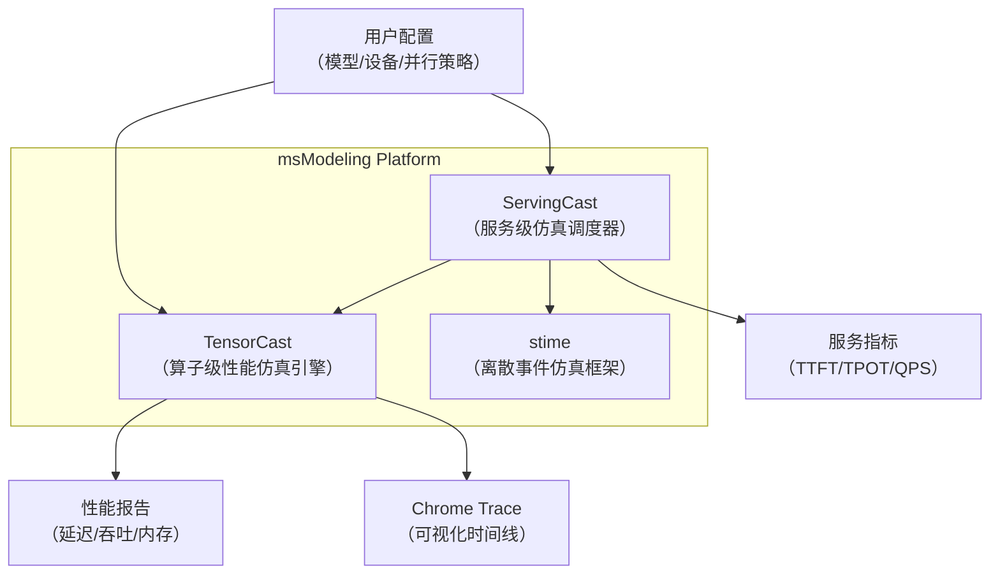
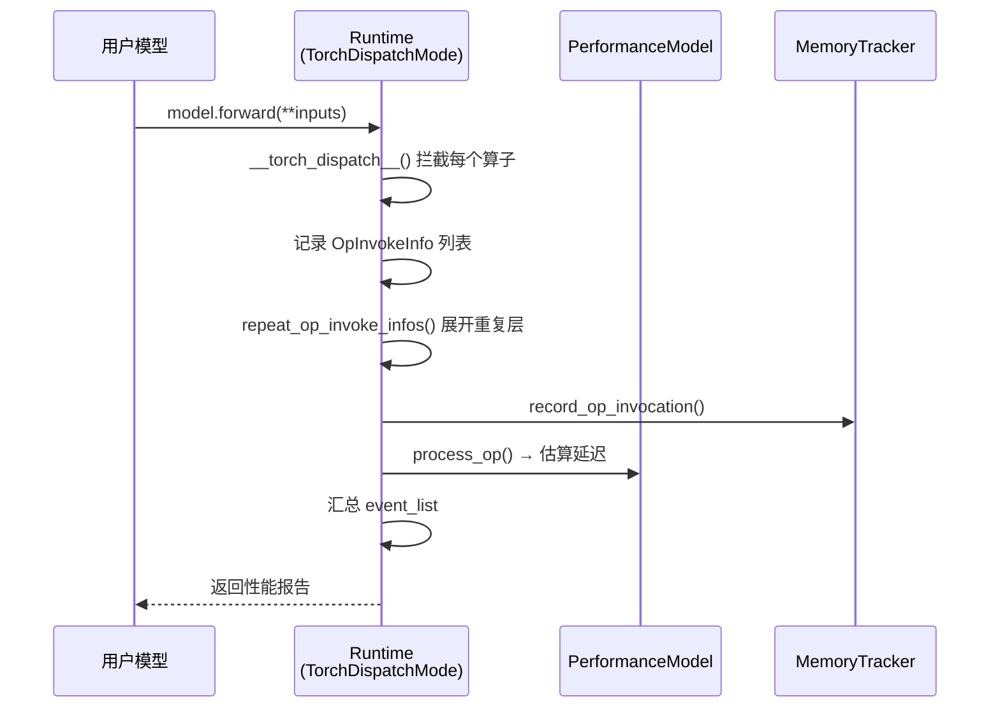

# 项目概览 — msModeling (MindStudio-Modeling)

## 一句话总结

> **msModeling 是一个面向昇腾（Ascend）NPU 的轻量级全系统性能仿真平台，通过拦截 PyTorch 算子图并结合 Roofline 解析模型与层级化互联建模，在无需真实硬件的条件下精确预测大语言模型推理的延迟、吞吐与内存占用，从而为分布式部署策略提供快速且低成本的决策依据。**

---

## 1. 研究背景

### 1.1 行业趋势

随着 GPT-4、DeepSeek-V3、Qwen3-235B 等千亿级大语言模型（LLM）的广泛部署，分布式推理已成为工业界的核心需求。关键技术挑战包括：

- **多卡/多机并行**：张量并行（TP）、数据并行（DP）、流水线并行（PP）和专家并行（EP）策略的联合优化。
- **硬件多样化**：昇腾 ATLAS 800 系列 NPU（A2/A3 架构）在国产化替代进程中需要独立的性能评估工具。
- **量化推理**：W8A8、W4A8、FP8、MXFP4 等多种低精度方案对硬件算力利用率的影响评估。
- **Prefill/Decode 分离架构（PD 分离）**：在服务化场景下，Prefill 和 Decode 阶段需要不同的调度与资源分配策略。

### 1.2 现有工具的局限性

| 局限性 | 说明 |
|--------|------|
| **硬件依赖** | 传统 benchmark 方案（如 vLLM Benchmark）依赖真实 NPU/GPU 硬件，部署成本高昂 |
| **黑盒评估** | 现有工具通常只提供端到端延迟，缺乏算子级（Operator-Level）的性能拆解能力 |
| **适配困难** | 面向 NVIDIA GPU 的工具（如 Nsight、NCU）无法直接适配昇腾 NPU 的互联拓扑与调度特性 |
| **服务化空白** | 缺少面向 LLM 推理服务端到端的仿真工具（含调度器、KV Cache 管理、负载均衡等） |

---

## 2. 核心贡献

### 2.1 系统架构概览

msModeling 由三大核心子系统构成：



| 子系统 | 入口 | 职责 |
|--------|------|------|
| **TensorCast** | `tensor_cast/` | 拦截 PyTorch 算子，结合 Roofline 模型估算每个算子的延迟与内存占用 |
| **ServingCast** | `serving_cast/` | 模拟 LLM 推理服务的完整生命周期：请求调度、KV Cache 管理、PD 分离/聚合 |
| **stime** | `stime.py` | 基于 [salabim](https://www.salabim.org/) 的离散事件仿真引擎，提供逻辑时间推进与协程调度 |

### 2.2 核心建模算法

#### A. Roofline 解析性能模型

核心实现位于 `tensor_cast/performance_model/analytic.py`，采用经典 Roofline 模型：

```
执行时间 = max(计算时间, 访存时间) + 静态调度开销
```

- **计算时间**：`MMA_OPS / (设备峰值算力 × 计算效率) + GP_OPS / (设备向量算力 × 计算效率)`
- **访存时间**：`(读字节数 + 写字节数 + 读写字节数) / (HBM 带宽 × 带宽效率)`
- **静态开销**：每个算子的固定调度代价（MMA 算子 ~5µs, GP 算子 ~2µs, 通信算子 ~10µs）

#### B. 层级化通信建模

核心实现位于 `tensor_cast/performance_model/comm_analytic.py`，支持多种集合通信原语的解析建模：

| 通信原语 | 建模算法 |
|----------|----------|
| **AllReduce** | Ring vs. Tree/Recursive Doubling 动态选优 |
| **AllGather** | Ring vs. Recursive Doubling 动态选优 |
| **ReduceScatter** | Ring vs. Recursive Halving 动态选优 |
| **AllToAll** | Pairwise Exchange vs. Bruck 动态选优 |

通信模型基于 `CommGrid` 层级互联拓扑自动选择最优算法：
- **CLOS 网络**：用于跨节点（outer dimension）通信
- **Full Mesh**：用于节点内（inner dimension）高速互联

#### C. Torch Dispatch 拦截机制

核心实现位于 `tensor_cast/runtime.py` 的 `Runtime` 类：



### 2.3 相对于 Baseline 的优势

| 维度 | 传统方案 | msModeling |
|------|----------|------------|
| **硬件依赖** | 需要真实 NPU/GPU | 纯 CPU 仿真，零硬件成本 |
| **粒度** | 端到端延迟 | 算子级拆解（计算/访存/通信） |
| **灵活性** | 固定硬件配置 | 参数化设备配置文件，可快速评估不同硬件方案 |
| **覆盖面** | 单模型推理 | 单卡推理 + 多卡并行 + 服务化调度 |
| **量化支持** | 有限 | W8A8/W4A8/FP8/MXFP4 + 静态/动态量化全覆盖 |
| **可视化** | 基本日志 | Chrome Trace 时间线 + 算子分类统计表 |

### 2.4 支持的硬件设备

| 设备 | 算力 (BF16) | HBM 容量 | HBM 带宽 | 互联类型 |
|------|-------------|----------|----------|----------|
| ATLAS_800_A2_376T_64G | 353.9 TFLOPS | 64 GB | 1.6 TB/s | CLOS + Full Mesh |
| ATLAS_800_A2_313T_64G | 294.9 TFLOPS | 64 GB | 1.6 TB/s | CLOS + Full Mesh |
| ATLAS_800_A2_280T_64G | 245.8 TFLOPS | 64 GB | 1.6 TB/s | CLOS + Full Mesh |
| ATLAS_800_A2_280T_64G_PCIE | 245.8 TFLOPS | 64 GB | 1.6 TB/s | 单层 PCIE |
| ATLAS_800_A3_752T_128G_DIE | 353.9 TFLOPS | 64 GB | 1.6 TB/s | 三层 CLOS + SIO |
| ATLAS_800_A3_560T_128G_DIE | 245.8 TFLOPS | 64 GB | 1.6 TB/s | 三层 CLOS + SIO |

### 2.5 支持的模型

已验证支持的大语言模型包括：

- **Qwen3 系列**：Qwen3-32B、Qwen3-235B（MoE）
- **DeepSeek 系列**：DeepSeek-V3（MoE + MTP）
- **GLM 系列**：GLM-4.5
- **Llama 系列**：Llama-2
- **多模态模型**：Qwen3-VL（视觉-语言模型）

---

## 3. 代码仓库结构

```
msModeling/
├── tensor_cast/                   # 算子级性能仿真引擎
│   ├── core/                      # 核心组件
│   │   ├── model_builder.py       # 模型构建
│   │   ├── model_runner.py        # 推理仿真入口
│   │   ├── config_resolver.py     # 配置解析管线
│   │   ├── user_config.py         # 用户配置
│   │   ├── input_generator.py     # 输入张量生成
│   │   └── quantization/          # 量化配置
│   ├── performance_model/         # 性能模型
│   │   ├── __init__.py            # 基类与算子属性注册
│   │   ├── analytic.py            # Roofline 解析模型
│   │   ├── comm_analytic.py       # 通信解析模型
│   │   ├── memory_tracker.py      # 内存追踪器
│   │   └── empirical.py           # 经验模型（预留）
│   ├── compilation/               # 编译优化
│   │   ├── compile_backend.py     # torch.compile 后端
│   │   ├── passes/                # 优化 Pass
│   │   └── patterns/              # 算子融合 Pattern
│   ├── ops/                       # 自定义算子
│   ├── layers/                    # 模型层实现
│   ├── transformers/              # 模型封装
│   ├── device_profiles/           # 硬件配置文件
│   ├── scripts/                   # CLI 入口
│   │   ├── text_generate.py       # 文本生成仿真
│   │   ├── benchmark.py           # 吞吐搜索
│   │   └── video_generate.py      # 视频生成仿真
│   ├── runtime.py                 # 核心仿真运行时
│   ├── parallel_group.py          # 并行通信组
│   ├── device.py                  # 设备配置文件定义
│   └── tests/                     # 单元测试
├── serving_cast/                  # 服务级仿真调度器
│   ├── engine.py                  # 批量调度引擎
│   ├── serving.py                 # PD 分离/聚合 Serving
│   ├── communication.py           # 通信信道
│   ├── model_runner.py            # 模型执行包装
│   ├── kv_cache_manager.py        # KV Cache 管理
│   ├── main.py                    # CLI 入口
│   └── tests/                     # 单元测试
├── stime.py                       # 离散事件仿真框架
└── docs/RFC/                      # 设计文档
```
