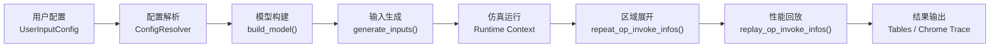
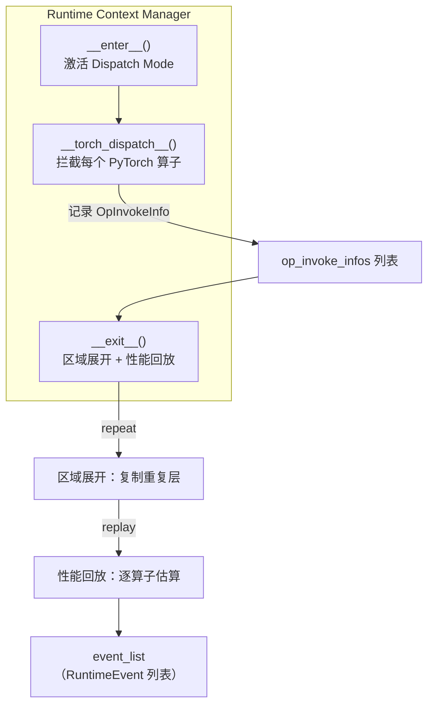
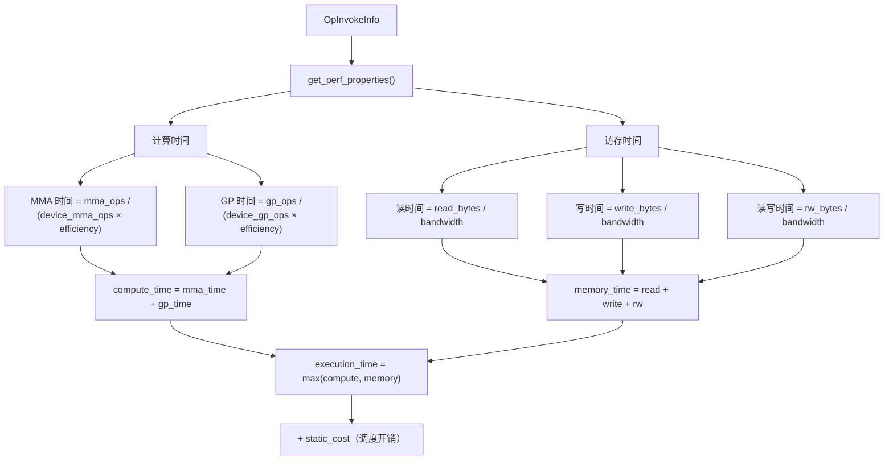
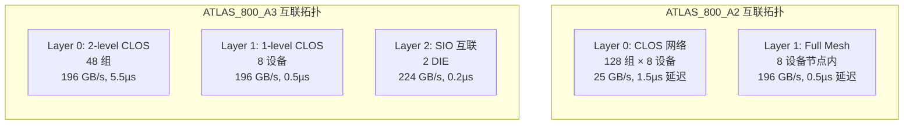
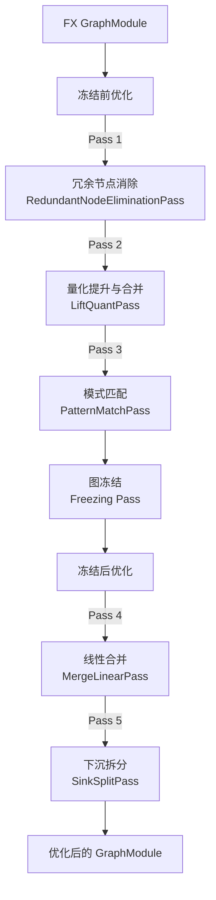
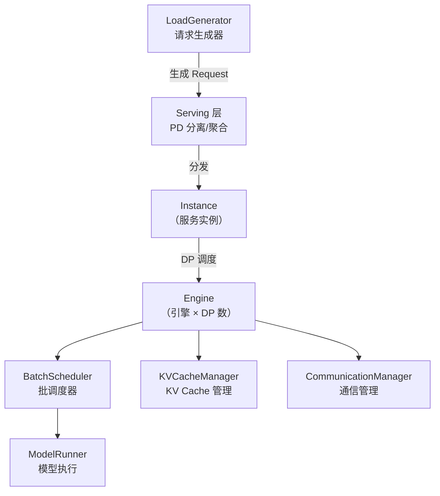
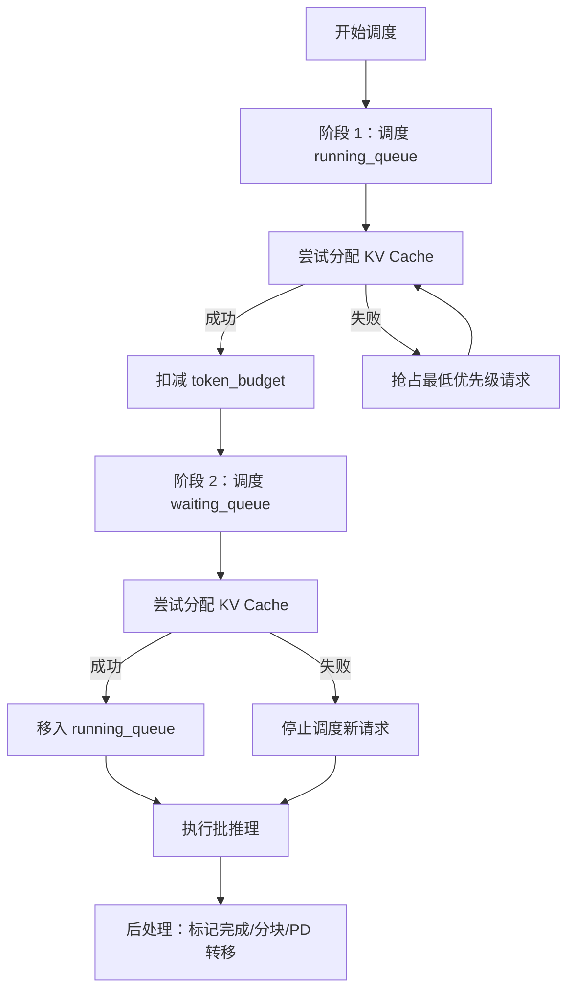
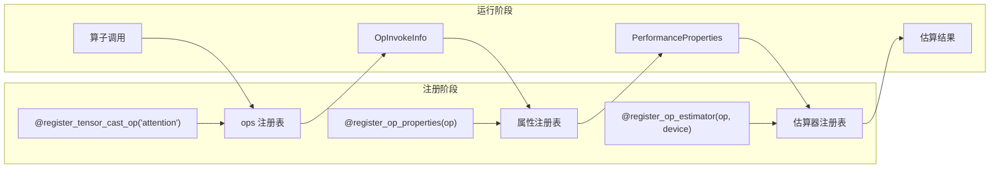

# 技术深度解析 — msModeling

## 目录

- [1. 关键技术 Overview](#1-关键技术-overview)
  - [1.1 TensorCast 仿真管线](#11-tensorcast-仿真管线)
  - [1.2 算子拦截与调度器](#12-算子拦截与调度器)
  - [1.3 算子性能建模](#13-算子性能建模)
  - [1.4 通信建模](#14-通信建模)
  - [1.5 内存追踪](#15-内存追踪)
  - [1.6 编译优化管线](#16-编译优化管线)
  - [1.7 ServingCast 服务仿真](#17-servingcast-服务仿真)
  - [1.8 离散事件仿真框架 stime](#18-离散事件仿真框架-stime)
- [2. 实验设置与性能指标](#2-实验设置与性能指标)
- [3. 设计模式](#3-设计模式)

---

## 1. 关键技术 Overview

### 1.1 TensorCast 仿真管线

TensorCast 的端到端仿真流程由以下阶段组成：



**阶段详解：**

#### 阶段 1：配置解析 (`tensor_cast/core/config_resolver.py`)

`ConfigResolver.resolve()` 方法（第 88-112 行）依次执行以下解析步骤：

```python
def resolve(self) -> ModelConfig:
    self.update_hf_config(enable_repetition, num_hidden_layers_override)
    self.update_moe_config(enable_redundant_experts, enable_external_shared_experts)
    self.update_mla_config()        # 多头潜在注意力（DeepSeek）
    self.update_mtp_config(num_mtp_tokens)  # 多 token 预测
    self.update_parallel_config()   # TP/DP/PP/EP 并行配置
    return self.model_config
```

支持的特性：
- **MoE（混合专家）**：冗余专家、外部共享专家
- **MLA（多头潜在注意力）**：适配 DeepSeek 系列模型
- **MTP（多 Token 预测）**：支持投机采样，可配置接受率
- **VL（视觉-语言）**：支持图像输入（如 Qwen3-VL）

#### 阶段 2：模型构建 (`tensor_cast/core/model_builder.py`)

`build_model()` 函数完成以下流程：
1. 加载 HuggingFace 模型配置
2. 应用量化配置（W8A8/W4A8/FP8/MXFP4）
3. 应用并行策略封装（TP/DP/PP/EP）
4. 可选：通过 `torch.compile()` 触发编译优化

模型封装类型定义在 `tensor_cast/transformers/model.py`（第 56-150 行）：
- `CausalLmWrapper`：标准因果语言模型
- `VLModelWrapper`：视觉-语言多模态模型
- `ModelWrapper`：通用模型封装

#### 阶段 3：输入生成 (`tensor_cast/core/input_generator.py`)

`generate_inputs_varlen()` 函数（第 32-156 行）生成仿真所需的全部输入张量：
- `input_ids`：token ID 序列
- `position_ids`：位置编码
- `AttentionMetadataTensorCast`：包含 Paged Attention 所需的 block table、slot mapping 等
- `kv_cache_by_layers`：分层 KV Cache 张量

关键数据结构 `RequestInfo`（第 19-29 行）定义了单个推理请求的参数：

```python
@dataclass
class RequestInfo:
    query_len: int         # 本次计算的新 token 数
    seq_len: int           # 总序列长度（上下文 + 查询）
    is_decode: bool        # 是否为 decode 阶段
    concurrency: int       # 批次大小
```

---

### 1.2 算子拦截与调度器

#### Runtime 核心机制 (`tensor_cast/runtime.py`)

`Runtime` 类继承自 `TorchDispatchMode`（第 36 行），这是 PyTorch 提供的低级别算子拦截机制：



**关键方法：**

| 方法 | 位置 | 功能 |
|------|------|------|
| `__torch_dispatch__()` | 第 69-77 行 | 拦截所有 PyTorch 算子调用，记录 `OpInvokeInfo` |
| `repeat_op_invoke_infos()` | 第 79-223 行 | 处理区域标记（`_internal_mark_region_begin/end`），将单层结果复制为全部层 |
| `replay_op_invoke_infos()` | 第 225-235 行 | 遍历所有算子，通过性能模型估算延迟 |
| `table_averages()` | 第 251-412 行 | 生成按算子分组的性能汇总表 |
| `get_trace_events()` | 第 414-488 行 | 生成 Chrome Trace JSON 格式的时间线事件 |
| `export_chrome_trace()` | 第 490-505 行 | 导出 Chrome Trace 文件 |
| `get_breakdowns()` | 第 507-528 行 | 获取算子分类的性能瓶颈分析 |

**区域展开机制（Region Repetition）：**

Transformer 模型的多个层结构相同，仿真时只需执行一层即可。通过 `_internal_mark_region_begin/end/copy_region` 三个标记算子：
1. 首先记录第一层的所有算子调用
2. 在 `repeat_op_invoke_infos()` 中将该层复制为 N 层
3. 每次复制会 `clone` 中间张量以保证内存追踪的正确性

---

### 1.3 算子性能建模

#### 1.3.1 性能模型基类 (`tensor_cast/performance_model/__init__.py`)

```python
class PerformanceModel(ABC):
    @dataclass
    class Result:
        execution_time_s: float              # 估算执行时间（秒）
        statistics: Dict[str, Any]           # 分项统计

    @abstractmethod
    def process_op(self, op_invoke_info: OpInvokeInfo) -> Result: ...
```

每个算子通过 `OpInvokeInfo` 携带完整的函数签名、输入参数、输出张量信息。

#### 1.3.2 算子属性注册系统

算子属性通过装饰器 `@OpInvokeInfo.register_op_properties()` 注册。每个注册函数负责从算子参数中提取：

```python
@dataclass
class PerformanceProperties:
    compute_ops: Dict[torch.dtype, ComputeOps]  # 按数据类型的计算量
    memory_read_bytes: float                      # 读内存字节数
    memory_write_bytes: float                     # 写内存字节数
    memory_readwrite_bytes: float                 # 读写内存字节数
```

其中 `ComputeOps` 区分两类计算：
- **MMA OPS（矩阵乘-累加）**：矩阵乘法运算量
- **GP OPS（通用处理）**：向量/标量运算量

**已注册的关键算子属性：**

| 算子 | 注册位置 | 关键建模逻辑 |
|------|----------|------------|
| `aten.bmm` / `aten.mm` | `__init__.py:250-316` | `MMA_OPS = M × N × K × 2`；读写字节数基于输入/输出张量形状 |
| `tensor_cast.static_quant_linear` | `__init__.py:381-408` | 根据量化类型（W8A8/W4A8）调整权重读取字节数与 INT8 计算量 |
| `tensor_cast.fp8_linear` | `__init__.py:411-422` | FP8 精度下的线性层：计算量按 FP8 FLOPS 评估 |
| `tensor_cast.mxfp4_linear` | `__init__.py:411-422` | MXFP4 精度下的线性层：计算量按 FP4 FLOPS 评估 |
| `tensor_cast.attention` | `__init__.py:550-563` | 两次 BMM + Softmax：`QK^T` 和 `Score × V` |
| `tensor_cast.attention_quant` | `__init__.py:566-627` | 量化注意力：包含额外的量化/反量化开销 |
| `tensor_cast.multihead_latent_attention` | `__init__.py:630-927` | MLA 注意力（DeepSeek）：包含潜在投影的计算与访存 |
| `tensor_cast.grouped_matmul` | `__init__.py:930-1021` | MoE 场景下的分组矩阵乘法 |
| `aten.convolution` | `__init__.py:1049-1139` | 卷积操作（视觉模型） |

#### 1.3.3 Roofline 解析模型 (`tensor_cast/performance_model/analytic.py`)

`AnalyticPerformanceModel.process_op()` 方法（第 108-111 行）通过注册表查找算子对应的估算函数。

核心估算逻辑 `_estimate_default_without_static_cost()`（第 131-195 行）：



#### 1.3.4 算子瓶颈分类器 (`OpBoundClassifier`)

位于 `tensor_cast/performance_model/analytic.py`（第 59-93 行），将每个算子分为四类：

| 分类 | 判定条件 |
|------|----------|
| `compute_bound_mma` | 计算时间最大，且 MMA 运算占主导 |
| `compute_bound_gp` | 计算时间最大，且 GP 运算占主导 |
| `memory_bound` | 访存时间最大 |
| `communication_bound` | 通信时间最大 |

---

### 1.4 通信建模

#### 1.4.1 层级互联拓扑 (`tensor_cast/device.py`)

`CommGrid` 类（第 25-58 行）定义了设备的层级互联结构：



#### 1.4.2 通信分析模型 (`tensor_cast/performance_model/comm_analytic.py`)

`CommAnalyticModel` 类为每种集合通信原语建模。以 `all_reduce()` 为例（第 114-163 行）：

**算法选择策略：**

```
Ring AllReduce:
    时间 = 2(N-1) × latency + 2(N-1)/N × message_size / bandwidth

Tree AllReduce:
    时间 = 2 × log2(N) × latency + 2 × message_size / bandwidth

最终时间 = min(Ring, Tree)
```

**拓扑匹配算法** `_get_topology_idx_for_group()`（第 33-85 行）：
1. 将每个 rank 转换为多维坐标
2. 找到坐标差异的最外层维度 `diff_dim`
3. 选择能覆盖该维度的最快拓扑

#### 1.4.3 并行通信组 (`tensor_cast/parallel_group.py`)

`ParallelGroup` 类封装了集合通信原语：

| 方法 | 对应算子 | 语义 |
|------|----------|------|
| `all_reduce()` | `torch.ops.tensor_cast.all_reduce` | 全归约 |
| `reduce_scatter()` | `torch.ops.tensor_cast.reduce_scatter` | 归约-散射 |
| `all_gather()` | `torch.ops.tensor_cast.all_gather` | 全收集 |
| `all_to_all()` | `torch.ops.tensor_cast.all_to_all` | 全交换（MoE EP） |

`ParallelGroupManager`（第 97-150 行）初始化各并行策略的通信组（TP/DP/PP/EP），通过设备网格确定每个 rank 所属的通信组。

---

### 1.5 内存追踪

#### MemoryTracker (`tensor_cast/performance_model/memory_tracker.py`)

采用两阶段方法进行内存分析：

**阶段 1 — 记录（Recording）**：`record_op_invocation()` 方法
- 提取每个算子的输入/输出张量
- 记录每个张量的定义位置（`def_op_idx`）和使用位置（`use_op_indices`）

**阶段 2 — 分析（Analysis）**：`analyze()` 方法
- 计算每个张量的生命周期（从定义到最后使用）
- 确定分配/释放时机：
  - **无定义**的张量（模型输入）：在开始时分配
  - **有定义有使用**的张量（中间结果）：定义后分配，最后使用后释放
  - **无使用**的张量（模型输出）：定义时分配，不释放

输出 `OpMemoryProfile` 包含每个算子执行前后的内存使用量。

---

### 1.6 编译优化管线

#### 编译后端 (`tensor_cast/compilation/compile_backend.py`)

当用户启用 `--compile` 选项时，msModeling 通过 `torch.compile()` 自定义后端对模型进行图优化：



**关键优化 Pass：**

| Pass | 位置 | 功能 |
|------|------|------|
| `RedundantNodeEliminationPass` | `passes/redundant_node_elimination_pass.py` | 移除无用/不可达节点 |
| `LiftQuantPass` | `passes/lift_quant_pass.py` | 将量化操作提升到图级别以便融合 |
| `PatternMatchPass` | `passes/pattern_match_pass.py` | 识别并替换常见模式（如 RMSNorm、RotaryEmbedding） |
| `MergeLinearPass` | `passes/merge_linear_pass.py`（第 24-150 行） | 合并共享输入的多个线性层（如 QKV 投影） |

**MergeLinearPass 详解：**

该 Pass 识别共享输入的多个线性操作，将它们的权重拼接为单个大矩阵乘法，再拆分输出。支持的算子类型：
- `static_quant_linear` / `static_quant_linear_int4`
- `aten.mm` / `aten.addmm`
- `fp8_linear` / `mxfp4_linear`

**模式匹配 Pattern：**

位于 `tensor_cast/compilation/patterns/` 目录：
- `rms_norm.py`：识别 RMSNorm 的算子序列，融合为单个 `rms_norm` 算子
- `rotary_embedding.py`：识别旋转位置编码的算子序列，融合为单个 `rope` 算子

---

### 1.7 ServingCast 服务仿真

ServingCast 模拟 LLM 推理服务的完整生命周期，支持 PD 分离（Prefill/Decode Disaggregation）和 PD 聚合两种部署模式。

#### 1.7.1 整体架构



#### 1.7.2 批调度器 (`serving_cast/engine.py`)

`BatchScheduler` 类（第 16-331 行）实现了核心调度逻辑 `_schedule()`（第 57-151 行）：

**调度流程：**



**关键机制：**
- **Token Budget**：每轮调度的最大 token 数限制（`max_tokens_budget`）
- **抢占策略**：当 KV Cache 不足时，抢占 running_queue 尾部（最低优先级）请求
- **分块 Prefill**：当 Prefill 超过 budget 时，自动分块处理
- **KV 转移**：PD 分离模式下，Prefill 完成后通过 Device-to-Device 通道转移 KV Cache

#### 1.7.3 Serving 层 (`serving_cast/serving.py`)

提供两种部署模式：

| 模式 | 类名 | 流程 |
|------|------|------|
| **PD 聚合** | `PdAggregationServing` | 请求 → 单一 Instance → Prefill + Decode |
| **PD 分离** | `PdDisaggregationServing` | 请求 → Prefill Instance → KV Transfer → Decode Instance |

两种模式均使用 `InstanceLoadBalancer` 进行贪心负载均衡（选择负载最小的实例）。

#### 1.7.4 通信管理 (`serving_cast/communication.py`)

`CommunicationManager` 管理两个通信信道：

| 信道 | 用途 | 配置参数 |
|------|------|----------|
| `host2device_channel` | 主机到设备的数据传输（Preprocessing） | 带宽 + 速率 |
| `device2device_channel` | 设备间 KV Cache 传输（PD 分离） | 带宽 + 速率 |

每个 `Channel` 是一个 `stime.Task`，异步处理字节传输请求。

---

### 1.8 离散事件仿真框架 stime

`stime.py` 封装了 [salabim](https://www.salabim.org/) 离散事件仿真库，提供以下核心抽象：

| 组件 | 功能 |
|------|------|
| `SimulationEnv` | 单例仿真环境（基于 `sim.Environment`） |
| `Task` | 仿真任务基类（基于 `sim.Component`），支持 `process()`、`wait()`、`notify()` |
| `elapse(ts)` | 推进当前任务的逻辑时间 |
| `Duration(ts)` | 上下文管理器，退出时推进逻辑时间 |
| `now()` | 获取当前仿真时间戳 |
| `get_logger()` | 带仿真时间戳的日志记录器 |

---

## 2. 实验设置与性能指标

### 2.1 硬件环境

代码中预设了以下硬件配置（`tensor_cast/device.py`）：

| 设备名称 | 架构 | BF16 算力 | FP16 算力 | INT8 算力 | HBM | 带宽 |
|----------|------|-----------|-----------|-----------|-----|------|
| `TEST_DEVICE` | 测试 | 353.9T | 353.9T | 707.8T | 64GB | 1.6TB/s |
| `ATLAS_800_A2_376T_64G` | A2 | 353.9T | 376T | 752T | 64GB | 1.6TB/s |
| `ATLAS_800_A2_313T_64G` | A2 | 294.9T | 313T | 626T | 64GB | 1.6TB/s |
| `ATLAS_800_A2_280T_64G` | A2 | 245.8T | 280T | 560T | 64GB | 1.6TB/s |
| `ATLAS_800_A3_752T_128G_DIE` | A3 DIE | 353.9T | 376T | 752T | 64GB | 1.6TB/s |
| `ATLAS_800_A3_560T_128G_DIE` | A3 DIE | 245.8T | 280T | 560T | 64GB | 1.6TB/s |

**效率参数（需要校准）：**
- 计算效率（`compute_efficiency`）：0.7（70%）
- 内存效率（`memory_efficiency`）：0.6（60%）
- 通信效率（`comm_efficiency`）：0.7（70%）

### 2.2 互联配置

| 拓扑 | 设备系列 | 结构 | 带宽 | 延迟 |
|------|----------|------|------|------|
| A2 HCCS | ATLAS_800_A2 | [128, 8] | 外层 25GB/s (CLOS)，内层 196GB/s (Full Mesh) | 1.5µs / 0.5µs |
| A2 PCIE | ATLAS_800_A2_PCIE | [8] | 64GB/s | 0.2µs |
| A3 SIO | ATLAS_800_A3 | [48, 8, 2] | 196GB/s (CLOS) + 224GB/s (SIO) | 5.5µs / 0.5µs / 0.2µs |

### 2.3 性能指标

TensorCast 输出的关键性能指标：

| 指标 | 含义 | 计算方式 |
|------|------|----------|
| **TPS/Device** | 单卡每秒处理 token 数 | `(num_queries × query_len) / (execution_time × world_size)` |
| **Execution Time** | 仿真执行时间 | 所有算子估算延迟之和 |
| **Peak Memory** | 峰值内存占用 | 模型权重 + KV Cache + 激活值 |
| **OpBound Breakdown** | 瓶颈分布 | `compute_bound_mma / gp / memory_bound / comm_bound` 百分比 |

ServingCast 输出的关键服务指标：

| 指标 | 含义 |
|------|------|
| **TTFT** | Time To First Token（首 token 延迟） |
| **TPOT** | Time Per Output Token（每 token 延迟） |
| **QPS** | 每秒处理请求数 |
| **Throughput** | 在 SLO 约束下的最大吞吐 |

### 2.4 Benchmark 搜索算法

`tensor_cast/scripts/benchmark.py` 中的 `find_best_throughput()` 函数实现了在 SLO 约束下的最优吞吐搜索：

```
对于 concurrency ∈ [1, max_concurrency]:
    1. 构造 batch = concurrency 个请求
    2. 运行仿真，获取 execution_time
    3. 计算 latency = execution_time / batch_mtp_tokens
    4. 如果 latency ≤ slo_limit:
        throughput = batch_mtp_tokens / execution_time
        记录最佳结果
    5. 否则跳过
返回最大吞吐对应的 (latency, concurrency, breakdown)
```

---

## 3. 设计模式

### 3.1 注册表模式 (Registry Pattern)

系统广泛使用装饰器注册表，解耦算子定义与性能估算逻辑：



**三层注册表：**
1. **算子注册表** (`tensor_cast/ops/`): `@register_tensor_cast_op()` — 定义自定义算子的函数式签名与输出形状
2. **属性注册表** (`tensor_cast/performance_model/__init__.py`): `@OpInvokeInfo.register_op_properties()` — 定义算子的计算量与访存量
3. **估算器注册表** (`tensor_cast/performance_model/analytic.py`): `@register_op_estimator()` — 定义特定设备上的性能估算函数

### 3.2 管线模式 (Pipeline Pattern)

端到端仿真形成清晰的多阶段管线：

```
配置解析 → 模型构建 → 输入生成 → 算子拦截 → 区域展开 → 性能回放 → 结果输出
```

每个阶段的输出是下一阶段的输入，职责单一且可独立测试。

### 3.3 访问者模式 (Visitor Pattern)

编译优化 Pass 遍历 FX 图的每个节点并进行变换：

```python
class TensorCastGraphModulePass:
    def __call__(self, gm: torch.fx.GraphModule):
        for node in gm.graph.nodes:
            if node.op == "call_function":
                # 访问并变换节点
```

每个 Pass 实现不同的变换逻辑，但共享相同的遍历骨架。

### 3.4 观察者模式 (Observer Pattern)

`OpBoundClassifier` 观察性能模型的执行结果，生成瓶颈分类报告：

```python
class OpBoundClassifier(PerformanceModel.OpClassifier):
    def classify(self, event_list):
        # 观察每个算子的执行结果
        # 分类为 compute_bound / memory_bound / comm_bound
```

### 3.5 策略模式 (Strategy Pattern)

- **性能模型**：`AnalyticPerformanceModel` 可替换为未来的 `EmpiricalPerformanceModel`
- **通信算法**：每种集合通信原语在运行时动态选择最优算法（Ring / Tree / Bruck 等）
- **调度策略**：`EngineLoadBalancer` 和 `InstanceLoadBalancer` 可替换为不同的负载均衡策略

### 3.6 上下文管理器模式 (Context Manager Pattern)

`Runtime` 通过 Python 的 `with` 语句管理仿真生命周期：

```python
with Runtime(perf_model, device_profile, memory_tracker=MemoryTracker(...)) as runtime:
    model.forward(**inputs)
# __exit__ 自动触发区域展开 + 性能回放
```

### 3.7 单例模式 (Singleton Pattern)

- `SimulationEnv`（`stime.py`）：全局唯一的仿真环境
- `Config.get_instance()`（`serving_cast/config.py`）：全局配置单例
- `DeviceProfile.all_device_profiles`：设备配置全局注册表
