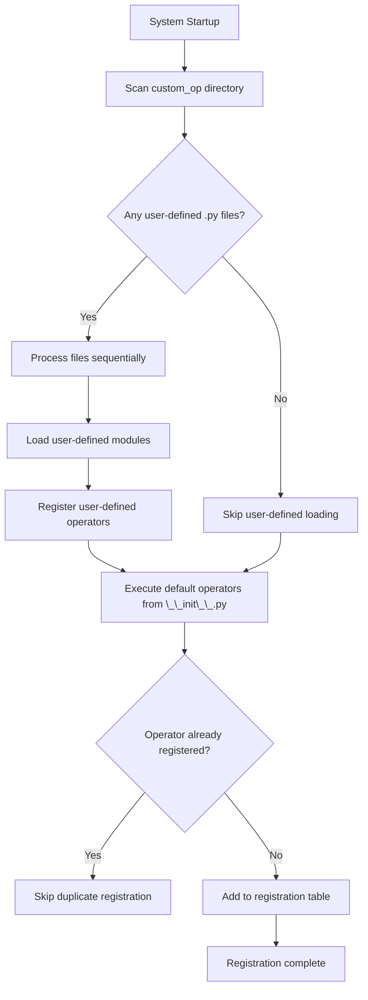

# RFC: Support for Custom Operator Modeling

## Metadata
| Item | Content                                        |
| :--- |:------------------------------------------|
| **Status** | Approved                                       |
| **Author** | genius52                                  |
| **Created Date** | 2026-1-19                                 |
| **Related Links** | https://gitcode.com/Ascend/msmodeling/pull/50 |

---

## 1. Overview
Need to provide unified performance modeling capabilities for user-defined PyTorch operators, support brand new operator implementations and existing operator overrides, to accurately evaluate memory footprint and computational overhead for performance analysis and optimization.

## 2. Solution Design

### 2.1 Recommended Solution

#### 2.1.1 Core Design
Provide operator performance modeling functionality based on the `OpInvokeInfo.register_op_properties` registration mechanism.

#### 2.1.2 User-defined Operator Loading
At system startup, scan all `.py` files under the `tensor_cast/performance_model/custom_op/` directory to automatically load all registered operator performance modeling functions.

#### 2.1.3 Operator Override Support
The operator override mechanism has been implemented. When users register with the same operator signature, user-defined performance modeling will automatically override the default implementation.

### 2.1.4 Startup Loading Registration Process

System startup loads and registers operator performance modeling implementations in the following sequence:

**Process Description**:

1. **Trigger Timing**: Execute `_preload_custom_op()` immediately at system startup
2. **Directory Scanning**: Traverse the `tensor_cast/performance_model/custom_op/` directory
3. **Module Loading**: Dynamically import each Python file using Python standard library
4. **Automatic Registration**: When modules are loaded, `@OpInvokeInfo.register_op_properties()` decorators automatically execute
5. **Registration Mechanism**: Store function pointers in the `OpInvokeInfo._op_properties_functors[op]` dictionary
6. **Override Mechanism**: Operators with same signature will have later registrations override earlier ones

### 2.2 Alternative Solutions

#### Solution 2: Configuration File-driven Approach
Define operator performance properties through JSON/YAML configuration files, but not recommended for the following reasons:

1. **Poor Expressiveness**: Unable to handle complex logic, dynamic computation, and runtime information
2. **Difficult Maintenance**: Configuration and code separation make debugging difficult and version control complex
3. **Insufficient Extensibility**: Difficult to adapt to future hardware characteristics and complex algorithm requirements

### 2.3 Solution Analysis

#### Advantages of Recommended Solution (Code Implementation):
- **Simple Implementation**: Clear code path, easy to understand and maintain
- **High Flexibility**: Supports various types of operators without architectural modifications
- **Accurate Computation Precision**: Supports multiple data types and complex logic
- **Good Integration with Existing Systems**: Extended based on existing registration mechanisms
- **Code Template**: Easy to reuse with low learning curve

#### Limitations of Recommended Solution:
- **Requires Manual Implementation**: Users must manually write modeling logic
- **Technical Threshold**: Performance evaluation of complex operators requires domain knowledge

## 3. Implementation Plan

### 3.1 Completed Features
- **Core Framework Implementation**: Operator performance modeling mechanism based on `OpInvokeInfo.register_op_properties`
- **Custom Operator Loading**: System automatically loads user-defined modeling by scanning `tensor_cast/performance_model/custom_op/` directory
- **Operator Override Support**: Complete operator override mechanism implemented, custom modeling automatically overrides default implementation

### 3.2 Next Steps
- **Template and Example Optimization**: Develop universal operator performance modeling templates and improve example code, providing more practical modeling cases
- **User Experience Improvement**: Simplify implementation complexity of user-defined modeling and reduce usage threshold