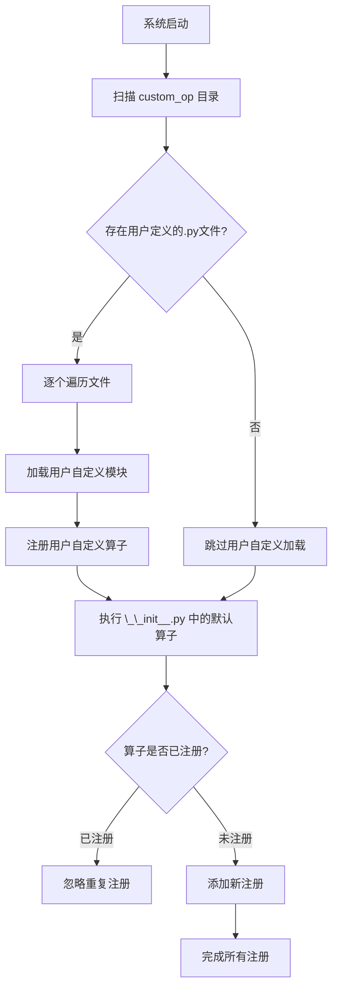

# RFC: 支持用户自定义算子建模

## 元数据
| 项目 | 内容                                        |
| :--- |:------------------------------------------|
| **状态** | 已批准                                       |
| **作者** | genius52                                  |
| **创建日期** | 2026-1-19                                 |
| **相关链接** | https://gitcode.com/Ascend/msit/pull/4911 |

---

## 1. 概述
需要为用户自定义PyTorch算子提供统一的性能建模能力，支持全新算子实现和已有算子覆盖，使其能够准确评估内存占用和计算开销，以便进行性能分析和优化。

## 2. 方案设计

### 2.1 推荐方案

#### 2.1.1 核心设计
基于 `OpInvokeInfo.register_op_properties` 注册机制，提供算子性能建模功能。

#### 2.1.2 用户自定义算子加载
系统启动时扫描 `tensor_cast/performance_model/custom_op/` 目录下的所有 `.py` 文件，自动加载所有注册的算子性能建模函数。

#### 2.1.3 算子覆盖支持
算子覆盖机制已实现。当用户使用相同算子签名注册时，用户自定义的性能建模会自动覆盖默认实现。

### 2.1.4 启动时加载注册流程

系统启动时会按以下顺序加载和注册算子性能建模实现：

**流程说明**：

1. **触发时机**：系统启动时立即执行 `_preload_custom_op()`
2. **目录扫描**：遍历 `tensor_cast/performance_model/custom_op/` 目录
3. **模块加载**：使用 Python 标准库动态导入每个 Python 文件
4. **自动注册**：当模块被加载时，其中的 `@OpInvokeInfo.register_op_properties()` 装饰器会自动执行
5. **注册机制**：将函数指针存储在 `OpInvokeInfo._op_properties_functors[op]` 字典中
6. **覆盖机制**：相同算子签名会后注册的覆盖先注册的

### 2.2 替代方案

#### 方案2：基于配置文件驱动的方式
通过JSON/YAML配置文件定义算子性能属性，但不推荐，理由如下：

1. **表达能力差**：无法处理复杂逻辑、动态计算和运行时信息
2. **维护困难**：配置与代码分离，调试困难，版本控制复杂
3. **扩展不足**：难以适应未来硬件特性和复杂算法需求

### 2.3 方案分析

#### 推荐方案（代码实现）优势：
- **实现简单**：代码路径清晰，易于理解和维护
- **灵活性高**：支持各种类型算子，无需架构修改
- **计算精度准确**：支持多数据类型和复杂逻辑
- **与现有系统集成良好**：基于现有注册机制扩展
- **代码模板化**：易于复用，学习成本低

#### 推荐方案局限性：
- **需要手动实现**：用户必须手动编写建模逻辑
- **技术门槛**：对复杂算子的性能评估需要领域知识

## 3. 实施计划

### 3.1 已完成功能
- **核心框架实现**：基于 `OpInvokeInfo.register_op_properties` 的算子性能建模机制
- **自定义算子加载**：系统扫描 `tensor_cast/performance_model/custom_op/` 目录自动加载用户自定义建模
- **算子覆盖支持**：完整实现算子覆盖机制，自定义建模自动覆盖默认实现

### 3.2 下一步计划
- **模板和示例优化**：开发通用的算子性能建模模板和完善示例代码，提供更多实用的建模案例
- **用户体验改进**：简化用户自定义建模的实现复杂度，降低使用门槛